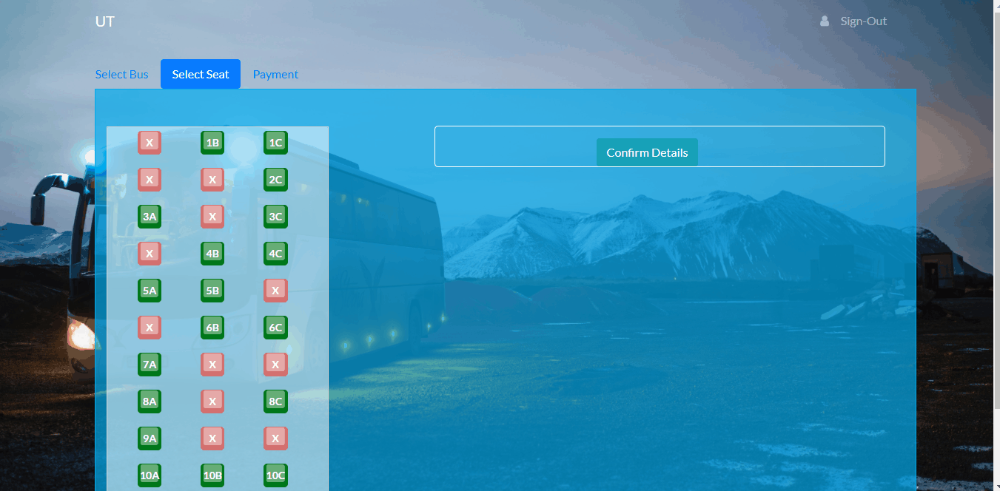
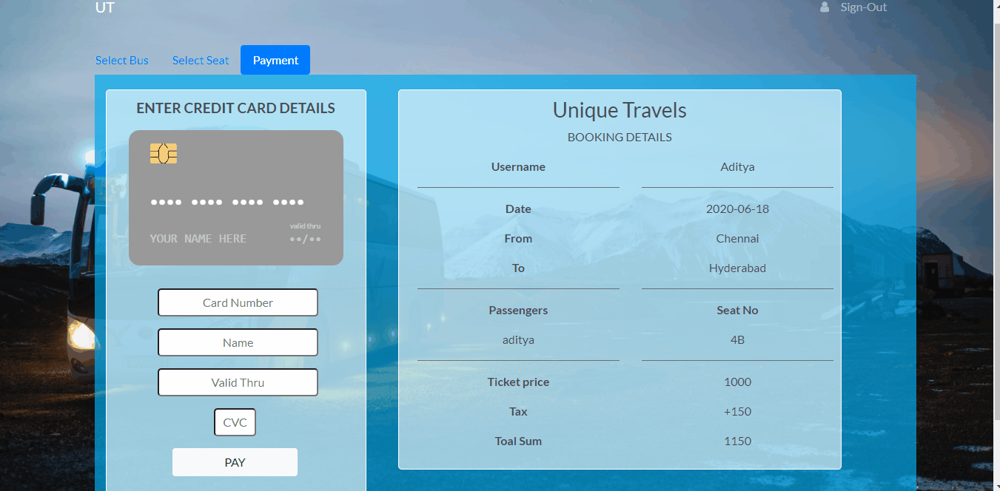

# MERN-BUS-APP

A Bus ticket booking application made using MERN Stack (MongoDB, Express js, React js, Node js)

The Bus ticket application is composed of the following Features:

### Front-End

* Sign-In & Sign-Up Pages.

* Uses Token based system, so only registered users can access the website.

* Has a profile page, which will display all information about the signed in user.

* List of cities for users to choose from (starting city & destination city). 

* Getting list of bus's of different companies with various details.

* Seat selection page has a very user friendly environment, which also generates dynamic forms for storing data's of passengers.

* Has a Confirmation page, which gets a debit card data using react-credit-cards. This version of the application does not include handling the payment process. 

* Final page has a ticket displaying component, it displays all passenger data and also generates a random number as a transaction ID.

### Back-End

* Uses Express js based application for the backend process.

* Uses MongoDB atlas for storing the collections.

* This version does not support dynamic seat data being stored from cloud.

This project also demonstrates:

* a typcial React project layout structure

**Screenshots:**
Landing Page:

Signing In Page:

Bus Selection Page:

Seat Selection Page:

Payment & Confirmation Page:

---

## Developed With

* [Visual Studio Code](https://code.visualstudio.com/) - A source code editor developed by Microsoft for Windows, Linux and macOS. It includes support for debugging, embedded Git control, syntax highlighting, intelligent code completion, snippets, and code refactoring
* [Node.js](https://nodejs.org/en/) - Javascript runtime
* [React](https://reactjs.org/) - A javascript library for building user interfaces
* [Babel](https://babeljs.io/) - A transpiler for javascript
* [Webpack](https://webpack.js.org/) - A module bundler
* [SCSS](http://sass-lang.com/) - A css metalanguage
* [Bootstrap 4](https://getbootstrap.com/) - Bootstrap is an open source toolkit for developing with HTML, CSS, and JS
* [Axios](https://github.com/axios/axios) - Promise based HTTP client for the browser and node.js
* [Express js](http://expressjs.com/) - Express is a minimal and flexible Node.js web application framework that provides a robust set of features for web and mobile applications.
* [MongoDB atlas](https://www.mongodb.com/cloud/atlas) - MongoDB Atlas is the global cloud database service for modern applications.
